# Initial photon emitter scaling experiments in Mitsuba3

## Background

The work here was done to try to reproduce the behaviour shown in the [Davis et al paper draft](https://github.com/UoMResearchIT/RTP-215-Photon-Propagation-Issue-Only/blob/development/ReportsAndPapers/Davis_etal_2309.12496v1.pdf), whereby no change in the time taken (at the render step in particular) was observed when increasing the number of photons up to a value of $10^8$.

## Method

We take the initial file at `csv/Photons_1000000_filtered.csv` and convert it into a format that can then be read into Mitsuba3, using the script at single_emitter_convert_photons.py.  Note: the initial file here is large and unsuitable for storage on "regular" GitHub, so only the converted file is stored on GitHub.  If access to this initial file is required then please ask.

Once the converted file is created, we end up with just under $10^6$ sets of photon data in it.  To run the experiments, use the script and command line arguments:

```
python single_emitter_test_new_change_nphotons.py variant n_repeats
```

where $variant$ is the Mitsuba3 variant that you wish to test. In this case, I have tested llvm_mono, llvm_ad_rgb (both locally and using the CPUs on the [HEP cluster](https://manhep.github.io/maf-helpdesk/noether_basic_usage.html)), and cuda_mono, cuda_ad_rgb (using the [GPUs available on the cluster](https://manhep.github.io/maf-helpdesk/noether_faq.html)).  `n_repeats` is used in order to perform the scaling tests; the data in the converted file is either sliced from this file (for values less than $10^6$), or created via repeating the amount of data in this file `n_repeats` times (for values greater than $10^6$).  

On my laptop CPU which has 16GB RAM readily available, I could set `n_repeats=19`, equating to around $1.8*10^7$ photons (any larger and it ran out of RAM).  Running on the cluster's interactive CPU or GPU node(s) gave me more RAM and allowed another order of magnitude in the experiments, up to approximately a value of `n_repeats=135` (approximately $1.26*10^8$ photons) before the GPU started running out of memory.  Note: the CPUs actually have slightly more memory available, so I was able to go to slightly higher values, but for the sake of the comparison I used a value that was runnable on both CPU and GPU.

This script runs to render what is known as a "Cherenkov ring" with `n_photons` in it, for values $10^N$ from $N=0$ to $N=8$, and then a final run at the size of the full (repeated) dataset.  In the local case where the memory meant simulating $10^8$ photons was not possible, this just leads to multiple extra runs at the full dataset size.  At each value of $N$, the experiment is repeated 11 times, and the results from all runs not including the first (which was observed to be slower in general than other runs) are stored.  The final output of this script is a file at `csv/`**variant**`_full_timing_for_n_photons.csv` (where `variant` is what was specified on the command line).  The data contained in this file is the number of photons, and then timings for the load step, the render step, the load and render steps combined, and then the full time for each case (load plus render plus plotting an image showing the rendered Cherenkov ring).

The script also outputs the rendered image of the Cherenkov ring to `png/`**variant**` new intensity = 1000, n photons = `**N**`.png` for each case, and then (as this experiment has been run previously), compares the results to a "known answer" and produces plots of the result, the known previous answer, and a difference image at `png/diff image `**variant**` new intensity = 1000, n_photons = `**N**`.png`.

Timing plots are then created from this timing CSV file by the following command

```
python single_emitter_plotting_timings.py variant
```

where `variant` is the Mitsuba3 variant used in the scaling tests.  This creates a file `csv/`**variant**`_stats_timing_for_n_photons.csv` which contains the average and standard deviation values for the 10 runs saved in the full_timing file, and creates a plot (with box-plot error bars based on the full set of timings at each value of $N$) of this data in the file `png/`**variant**`_timing_for_n_photons.png`.

The above is then repeated for different Mitsuba3 variants at the same values of $N$ and `n_repeats`.  Once runs and plots for all variants have been completed, it is then possible to run

```
python single_emitter_plotting_variants.py
```

to create plots which compare the timings from the runs for each of the different variants, which are saved in the files `png/`**stage**`_timing_for_n_photons.png` where `stage` is "load", "render", etc.

## Results

Results were obtained both on my local laptop's CPU `12th Gen Intel(R) Core(TM) i7-1255U   1.70 GHz` using 16GB of RAM, and also on the [noether HEP cluster](https://manhep.github.io/maf-helpdesk/noether_faq.html).  At time of writing, the available nodes were:

- 8 with 96 cores / 384GB RAM (4GB/core, Intel(R) Xeon(R) Gold 5220R CPU @ 2.20GHz).
- 20 with 16 cores / 64 GB RAM (4GB/core, Intel(R) Xeon(R) CPU E5-2620 v4 @ 2.10GHz).
- 3 GPU nodes each with 3 Tesla V100 GPUs and 32 cores / 128 GB RAM (4GB/core, Intel(R) Xeon(R) CPU E5-2620 v4 @ 2.10GHz).

I ran each experiment on the cluster on a single available interactive node; in the CPU case this is (I think) a node from the second set listed above.

All PNGs and CSVs created for this experiment can be found in the `experiment_01` directory at the level of this file.

### Local results

A plot of the results of running the `llvm_mono` variant locally is shown below for $10^7$ photons


The script also compares this to previously known results and plots a difference image


Similar results are obtained when running other experiments (though clearly there will be more differences for the lowest values of $N$).

Averaged timing results for running `llvm_mono` and `llvm_ad_rgb` variants locally are shown below.

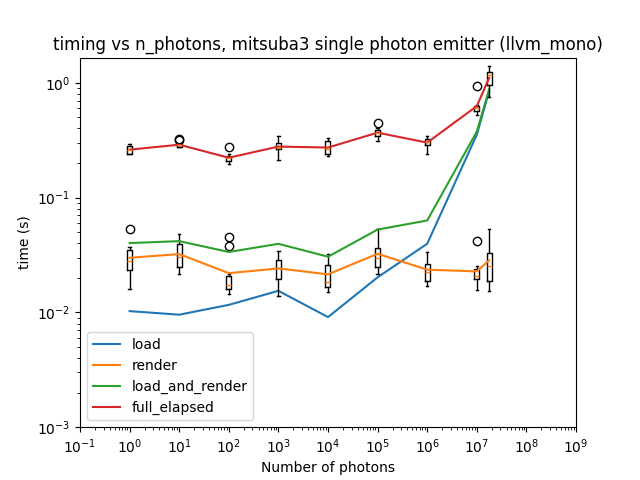
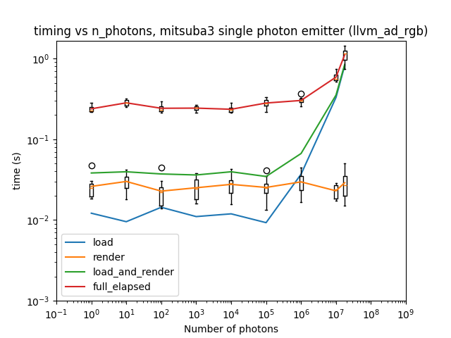

Comparing the results for each step in Mitsuba3 across variants is shown below.

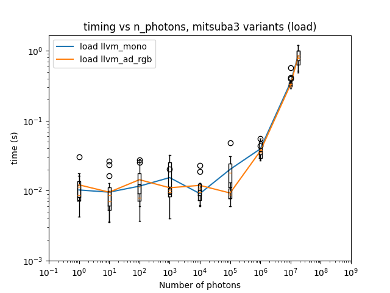
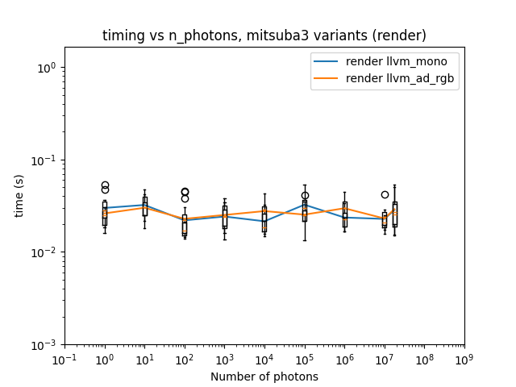
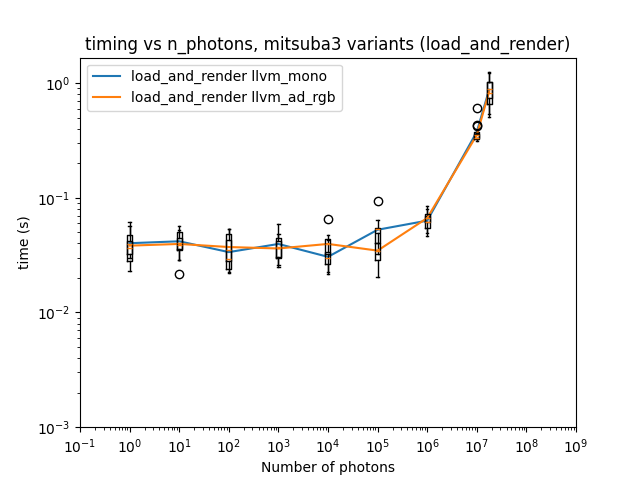
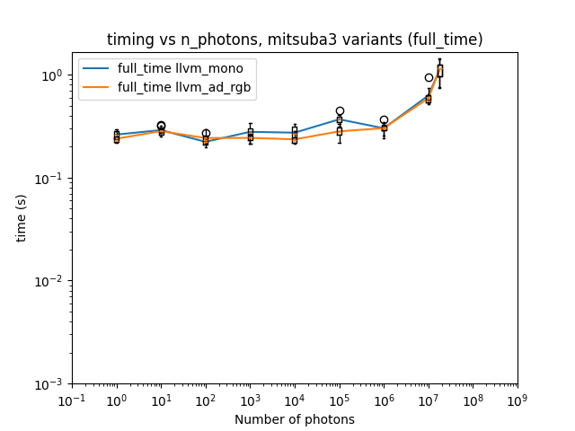

Although this only goes up to just above $10^7$ photons, this shows agreement with the previous work, in particular for the render step.

### Cluster results

A plot of the results of running the `llvm_mono` variant on the cluster is shown below for $10^8$ photons, along with a difference image.


Similar results are obtained when running the `cuda_mono` variant.


Averaged timing results for running `llvm_mono` and `llvm_ad_rgb` (CPU), and `cuda_mono` and `cuda_ad_rgb` (GPU) variants on the cluster are shown below.

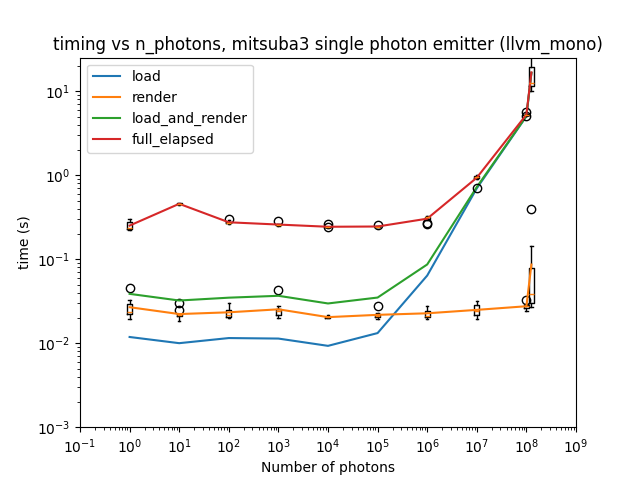
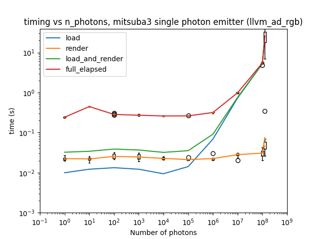
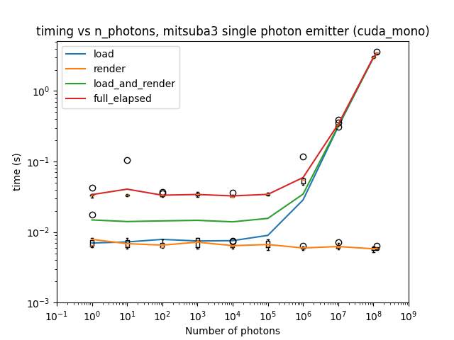
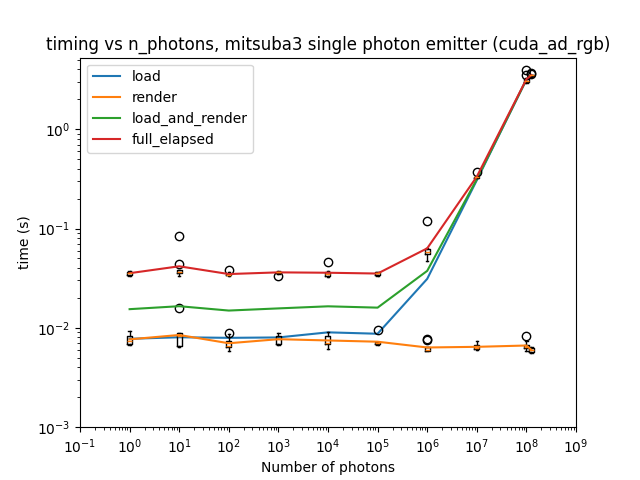

Comparing the results for each step in Mitsuba3 across variants is shown below.

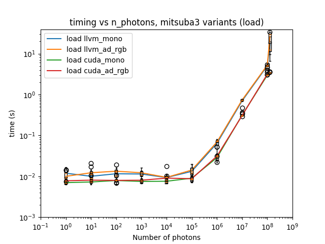
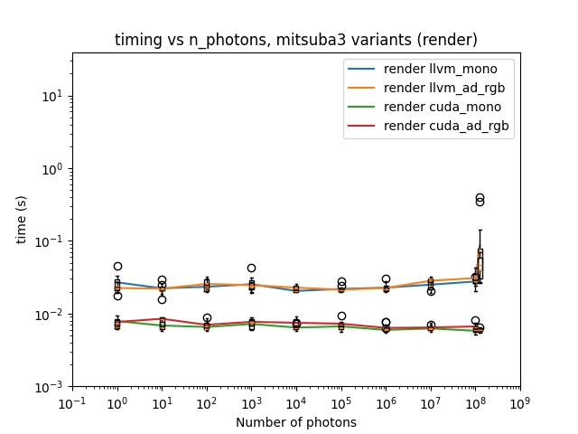
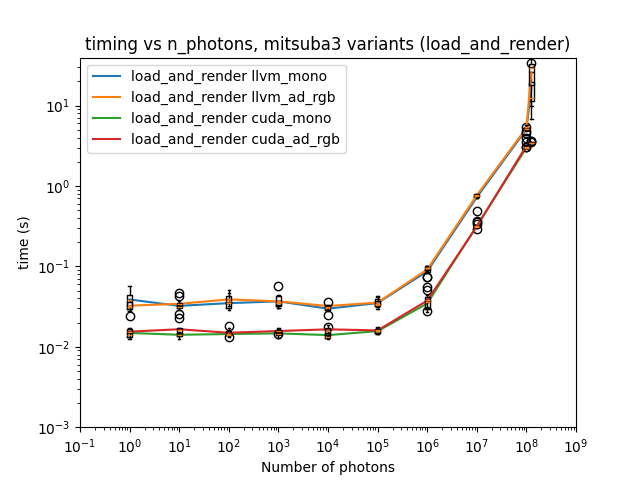
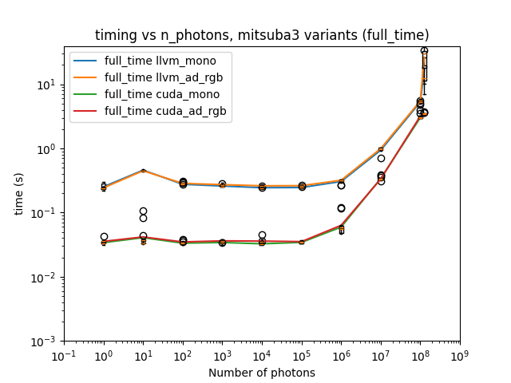

These again appear to show some agreement with the previous work in the current paper draft in terms of there being no increase in time taken when running the render step, though in the draft there is a suggestion that there is also no increase in time taken when running Mitsuba3 at the load step between $10^7$ and $10^8$, which there clearly is in these cases. It may be that e.g. figure 7 in the paper draft looks "flat" for the Mitsuba3 results compared to the Geant4 results.

## Conclusions and future work

One conclusion to make here is to ask whether there is any "rendering" taking place on what I have here called the load step (which is calling `mi.load_dict(...)` in Mitsuba3), compared to what happens on the render step (calling `mi.render(...)`).  

I have also just noticed that my timing starts before creating the dictionary that is called by `mi.load_dict(...)` is done; it may be that the time is taken in creating the dictionary rather than loading it into Mitsuba3; this needs to be investigated, since there is some disagreement between my timing results and the timing results in the paper draft.

There are also different loading methods which could be investigated; using `photon_emitter` (loading a python list created from a CSV file) and `photon_emitter_old` (loading a binary file) may have timing differences.  It is also possible to load in scenes from XML files rather than using python dictionaries, and this should also be checked.

GitHub issues have been created to follow up on this work and further investigate the performance and scaling:

- [XML vs python dict](https://github.com/UoMResearchIT/mitsuba3-manchester/issues/7)
- [Binary vs python list from CSV](https://github.com/UoMResearchIT/mitsuba3-manchester/issues/8)
- [Split the timing so that load_dict is measured separately from dictionary creationg](https://github.com/UoMResearchIT/mitsuba3-manchester/issues/10)

