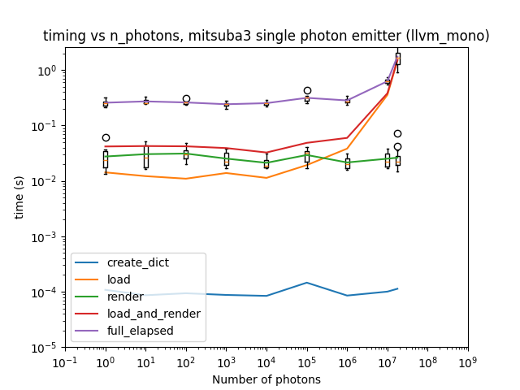
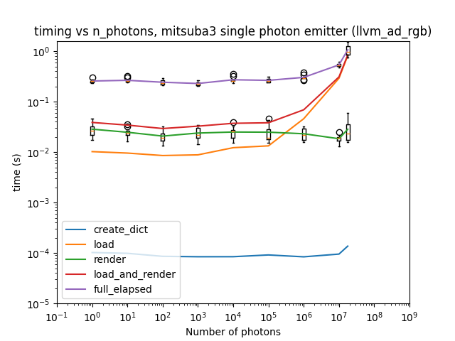
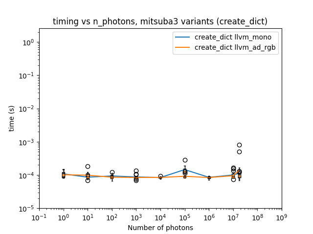
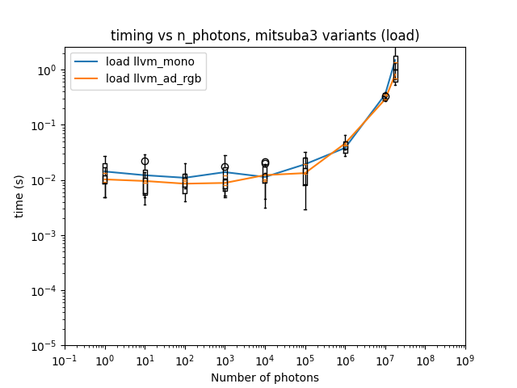
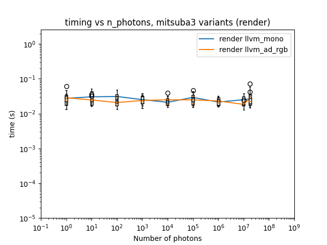
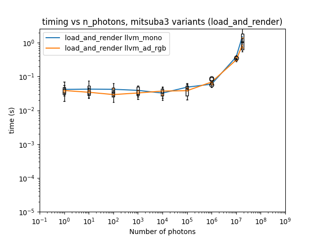
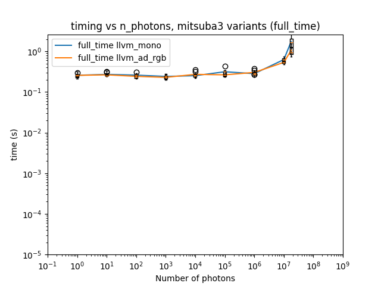

# Add a step to measure dictionary creation time to experiment 01

## Background / Method

This is a repeat of experiment_01, but with measurement of the dictionary creation step added. 

The code changes required to do this will be saved to a new branch, but not (yet) merged into `dev`, with the name `measure_time_for_dict_creation`.

## Results

Results were obtained both on my local laptop's CPU `12th Gen Intel(R) Core(TM) i7-1255U   1.70 GHz` using 16GB of RAM.

All PNGs and CSVs created for this experiment can be found in the `experiment_02` directory at the level of this file.

Averaged timing results for running `llvm_mono` and `llvm_ad_rgb` variants locally are shown below.

Comparing the results for each step in Mitsuba3 across variants is shown below.

This shows that the create_dict step is orders of magnitude faster than the other steps, and therefore negligible compared to the other steps already being measured, so it's not necessary to measure it separately.

## Conclusions and future work

The time taken for the Mitsuba `load_dict(...)` step is what changes with the number of photons.  Further investigation of whether it is faster to load from XML or to use `photon_emitter_old` and load from a binary file is needed.

Remaining GitHub issues for performance / scaling:

- [XML vs python dict](https://github.com/UoMResearchIT/mitsuba3-manchester/issues/7)
- [Binary vs python list from CSV](https://github.com/UoMResearchIT/mitsuba3-manchester/issues/8)

