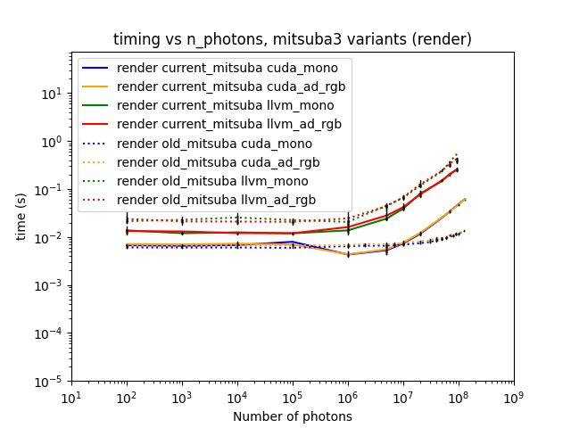
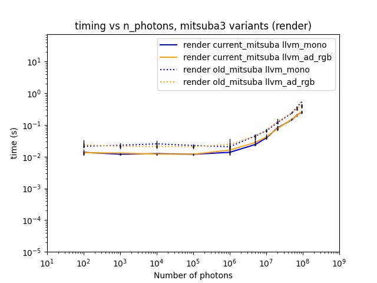
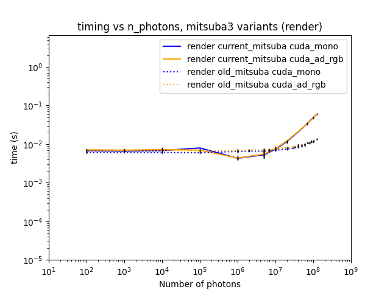
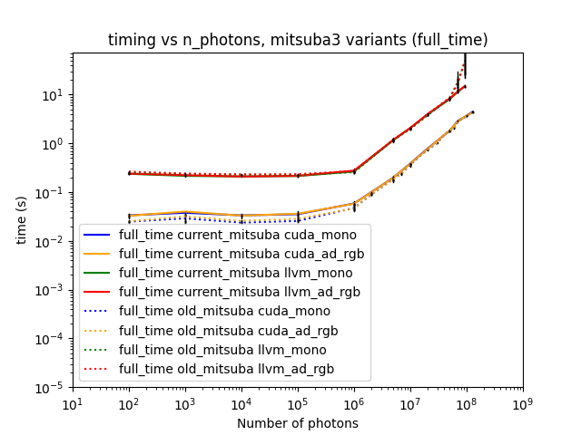
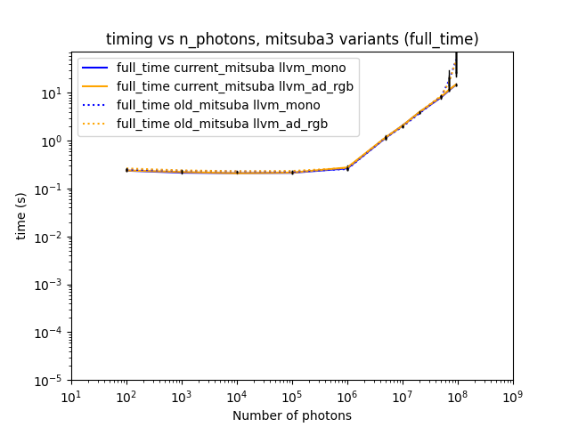
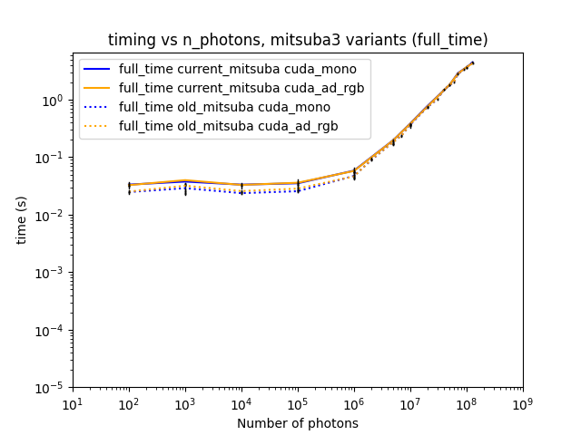

# Compare the most recent stable version of Mitsuba to previous versions used in earlier experiments

## Background / Method

After updating the Manchester fork of Mitsuba to match changes in Mitsuba itself, it was noticed that the scaling behaviour seemed to have changed for larger numbers of photons. This experiment was run to check whether this was the case; the same Mitsuba script (`single_emitter_test_new_change_nphotons_and_sample_count.py`) was run using the following versions:

- The "current" version of the Manchester fork (this was tested on `dev` at commit id `7350f312` from September 2026)
- The "old" version of the Manchester fork around the time of previous experiments (commit id `ceb0e8f`)

Given the change in behaviour, it was also instructive to modify the script from previous experiments slightly so that more photon sizes were investigated between $10^6$ and $10^8$ to obtain a better idea of what is now happening versus what was previously happening.

Note: the current version of the Manchester fork detailed above is based on the last stable release of Mitsuba3; the `master` branch of Mitsuba3 is currently ahead of the `dev` branch of the Manchester fork, but the work on it is currently experimental and does not compile and run successfully on my local machine. If there is interest in looking at this experiment again in the future, my suggestion is to update the Manchester fork against the `stable` branch of Mitsuba instead of the `master` branch (as suggested in the [Mitsuba compilation instructions](https://mitsuba.readthedocs.io/en/stable/src/developer_guide/compiling.html)), once the Mitsuba developers make another release (look at the [GitHub release page](https://github.com/mitsuba-renderer/mitsuba3/releases) for this).

## Results

Results were obtained on both the CPUs and GPUs of the Noether HEP cluster, details of which can be found in experiment_01's write-up.

All timing PNGs and CSVs created for this experiment can be found in the `experiment_07` directory at the level of this file.

Comparing the results for the render step in Mitsuba3 across variants and Mitsuba versions ("current" as solid lines, "old" as dotted lines) is shown below.

Looking at the results for CPU (`llvm`) and GPU (`cuda`) variants in turn, we see first for the CPU case that there has been a slight performance gain overall, but no change in the actual behaviour:

For the GPU case, however, there has been a marked change in behaviour at higher numbers of photons:

This shows that there have been changes in Mitsuba that have directly affected our particular experiment.  From reading the more recent updates, it seems as though the most recent work has been targeting Apple Silicon through a new Metal backend (see e.g. https://drjit.readthedocs.io/en/latest/changelog.html#drjit-1-4-0-june-25-2026), so it may be that this has had some effect on behaviour when running on other backends (as we do).

In terms of the effect on the full time taken to run experiments, however, this change in behaviour on the render step is negligible; the following graphs show that the full time spent has not been greatly affected:

## Conclusions and future work

The current behaviour is perhaps more what we would have expected to see (i.e. some scaling once the number of photons is large enough) compared to what we were seeing (effectively very little or no scaling at all when change the number of photons). It may be worth asking the Mitsuba developers for their opinion/input on this.
